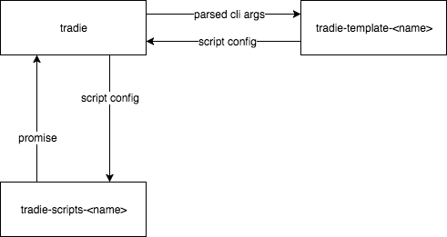

# Build your own...

1. `tradie` parses the CLI arguments.
2. `tradie-template-<name>` takes the CLI arguments and uses them to create a configuration object usable by `tradie-scripts-<name>`.
3. `tradie-scripts-<name>` receives the configuation object and does something with it (starts transpiling, spins up a server whatever) and returns a promise to let `tradie` know when its finished.

## Templates

Templates encapsulate the configuration of the tools (e.g. `flow`, `babel`, `webpack`, `jest` and `express`).

`tradie` comes with a number of pre-built templates. Each of these templates come with Zero Configuration (but your templates don't have to). Build or fork your own when you require custom configuration (e.g. you want to use the `sass-loader` with `tradie-template-react-site`).

A template **MUST** be named like:

    tradie-template-<name>
    
OR

    @<your-org>/tradie-template-<name>

A template **MUST** have the `tradie` package and a `tradie-scripts-*` package listed in their dependencies.

A template **MUST** expose:

- A `lib` directory containing a module for each script exposed by the chosen `tradie-scripts-*` pacakge e.g. `lib/build.js`.

## Scripts

Scripts encapsulate the running of the tools (e.g. `flow`, `babel`, `webpack`, `jest` and `express`).

`tradie` comes with a number of pre-built scripts. Each of these are built for a particular type of project. Build or fork your own when you're building a new type of project.

A scipt **MUST** be named like:

    tradie-scripts-<name>
    
OR

    @<your-org>/tradie-scripts-<name>

A script **MUST** expose:

- A `lib/__args__.js` module that exports a function. The function will be passed an instance of `yargs` and should configure the necessary commands and arguments it requires.
- A `lib` directory cotaining a module for each configured command e.g. `lib/build.js`. Each script module should export a function that returns a promise when the command is complete. The script will be passed a configuration object, configured as desired by a template.
